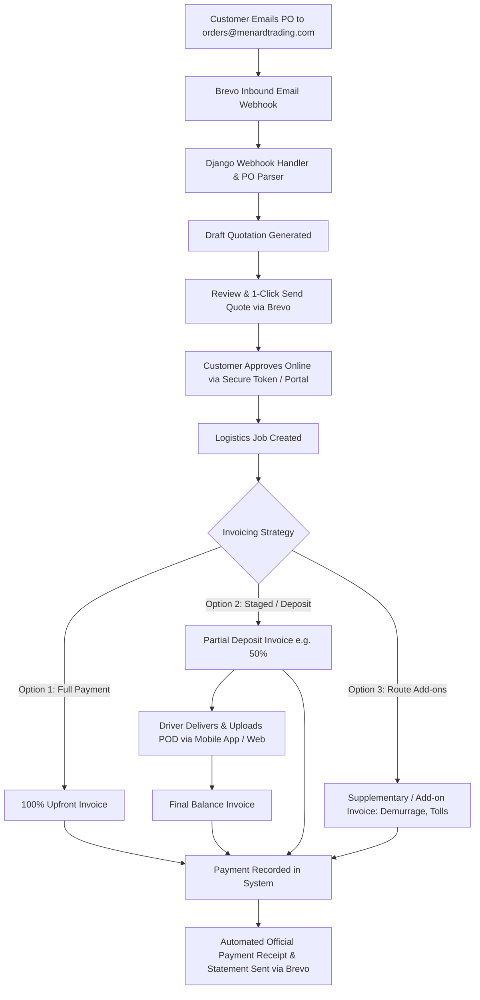

# Automated Logistics Order & Billing System — Implementation Blueprint
**Client / Brand:** Menard Trading CC (`menardtrading.com`)  
**Architecture:** Django + Tailwind CSS + HTMX (Web & Portal) + Django REST Framework (Mobile App & Webhook API) + Brevo Multi-Sender SMTP & Inbound Webhooks + Dynamic PDF Engine

---

## 1. System Overview & Order-to-Cash Workflow

The **Automated Logistics Order & Billing System** automates the entire lifecycle of freight and transport jobs for **Menard Trading CC**:



---

## 2. Technical Stack & Architecture

| Layer | Component | Purpose |
| :--- | :--- | :--- |
| **Core Framework** | Django 5.x | ORM, business logic, authentication, and core admin |
| **API Layer (Mobile Ready)** | Django REST Framework (DRF) | RESTful API (`/api/v1/`) for future mobile driver apps & webhooks |
| **Frontend & UI** | Django Templates + Tailwind CSS + HTMX | High-performance, reactive operations dashboard with 0 client build bloat |
| **Secrets & Config** | `python-decouple` + `.env` | Environment isolation for Brevo API keys & database credentials |
| **Email Gateway** | Brevo (formerly Sendinblue) | Inbound PO email parsing & transactional multi-sender dispatch |
| **PDF Generation** | `WeasyPrint` / `xhtml2pdf` | High-definition, branded Quotations, Invoices, and Payment Receipts sharing Tailwind styles |
| **Data Parsing** | `pdfplumber` / `pypdf` + OCR/AI Parser | Automated extraction of PO numbers, routes, weights, and cargo data |
| **Database** | PostgreSQL / SQLite (Dev) | Structured relational schema with multi-stage balance tracking |

---

## 3. Step-by-Step Implementation Roadmap

### Phase 1: Environment & Django Project Initialization

1. **Initialize Virtual Environment & Dependencies**:
   ```bash
   python -m venv venv
   source venv/Scripts/activate  # On Windows: venv\Scripts\activate
   pip install django djangorestframework python-decouple django-cors-headers weasyprint pdfplumber requests
   ```
2. **Project Structure**:
   ```text
   menardtrading/
   ├── manage.py
   ├── .env
   ├── AGENTS.md
   ├── menard_core/            # Project settings, wsgi, urls
   │   ├── settings.py
   │   ├── urls.py
   │   └── brevo_backend.py    # Custom multi-sender email dispatcher
   ├── apps/
   │   ├── customers/          # Customer directory, credit limits, contacts
   │   ├── orders/             # Inbound POs, attachments, parser logic
   │   ├── quotes/             # Quotation builder, line items, approval tokens
   │   ├── logistics/          # Jobs, trips, drivers, POD (Proof of Delivery)
   │   ├── billing/            # Invoices (Full/Partial/Add-ons), Payments, Receipts
   │   └── webhooks/           # Brevo inbound email receivers & event handlers
   ├── templates/
   │   ├── emails/             # Branded HTML email templates for Brevo
   │   ├── pdfs/               # Quote, Invoice, and Receipt PDF templates
   │   └── dashboard/          # Operations and Billing Dashboard
   └── static/
       ├── css/
       └── images/             # Menard Trading CC logo, stamps, signatures
   ```

3. **Configure Environment Variables (`.env`)**:
   ```ini
   SECRET_KEY=django-secure-key-here
   DEBUG=True
   BASE_URL=https://menardtrading.com

   # Brevo SMTP Configuration
   BREVO_SMTP_HOST=smtp-relay.brevo.com
   BREVO_SMTP_PORT=587
   BREVO_SMTP_FALLBACK_PORT=2525
   BREVO_SMTP_USER=b4eb80001@smtp-brevo.com
   BREVO_SMTP_PASSWORD=xsmtpsib-YOUR-API-KEY-HERE

   # Webhook Security
   BREVO_WEBHOOK_SECRET=menard-secure-webhook-token
   ```

---

### Phase 2: Database Schema & Relational Models

#### 1. `apps/customers/models.py`
* **`Customer`**:
  * `company_name`, `contact_name`, `email`, `phone`, `vat_number`, `physical_address`, `billing_address`.
  * `payment_terms` (e.g. *100% Upfront, 50% Deposit / 50% on POD, 30 Days Net*).

#### 2. `apps/orders/models.py`
* **`PurchaseOrder`**:
  * `customer` (FK Customer), `po_number`, `po_date`, `status` (`RECEIVED`, `PARSED`, `QUOTED`, `COMPLETED`).
  * `raw_email_sender`, `raw_email_subject`, `po_file` (Original PDF attachment).
  * Extracted Logistics Info: `pickup_location`, `delivery_location`, `cargo_description`, `weight_tons`, `volume_cbm`, `special_instructions`.

#### 3. `apps/quotes/models.py`
* **`Quotation`**:
  * `quote_number` (e.g. `QT-2026-0001`), `purchase_order` (1-to-1 PO), `customer`.
  * `subtotal`, `vat_rate` (15%), `vat_amount`, `total_amount`, `valid_until`.
  * `status` (`DRAFT`, `SENT`, `APPROVED`, `REJECTED`, `EXPIRED`).
  * `approval_token` (UUID for secure customer 1-click approval link).
* **`QuoteLineItem`**:
  * `description` (e.g. *Long-haul freight Johannesburg to Durban, 34-ton tautliner*).
  * `quantity`, `unit_price`, `total_price`.

#### 4. `apps/logistics/models.py`
* **`LogisticsJob`**:
  * `job_number` (e.g. `JOB-2026-0001`), `quote` (FK Quote), `status` (`PENDING`, `DISPATCHED`, `IN_TRANSIT`, `DELIVERED`, `POD_RECEIVED`).
  * `vehicle_reg`, `driver_name`, `driver_phone`.
  * `pod_document` (Proof of Delivery scan/photo).

#### 5. `apps/billing/models.py`
* **`Invoice`**:
  * `invoice_number` (e.g. `INV-2026-0001`), `job` (FK LogisticsJob), `customer`.
  * `invoice_type`:
    * `FULL`: 100% upfront or standard full invoice.
    * `PARTIAL_DEPOSIT`: Deposit invoice (e.g. 50% advance).
    * `PARTIAL_BALANCE`: Final balance invoice (e.g. remaining 50% on delivery).
    * `ADD_ON`: Supplementary invoice (e.g. Driver Detention/Waiting hours, Demurrage, Extra Tolls, Border Clearances).
  * `subtotal`, `vat_amount`, `total_amount`, `amount_paid`, `balance_due`.
  * `status` (`DRAFT`, `ISSUED`, `PARTIALLY_PAID`, `PAID`, `OVERDUE`, `CANCELLED`).
  * `due_date`, `notes`.
* **`InvoiceLineItem`**:
  * `description`, `quantity`, `unit_price`, `total_price`.
* **`PaymentReceipt`**:
  * `receipt_number` (e.g. `RCP-2026-0001`), `invoice` (FK Invoice), `customer`.
  * `amount_paid`, `payment_method` (`EFT_BANK_TRANSFER`, `CREDIT_CARD`, `CASH`), `payment_date`.
  * `transaction_reference` (Bank confirmation code / POP reference).
  * `receipt_pdf` (Generated branded PDF).

---

### Phase 3: Brevo Multi-Sender Email Engine & Branding

Create a dedicated email dispatcher in `menard_core/brevo_email.py`:
1. **Departmental Senders**:
   * `orders@menardtrading.com`: PO confirmations and operational notices.
   * `quotes@menardtrading.com`: Quotations & quote approval requests.
   * `accounts@menardtrading.com`: Invoices, balance reminders, and official receipts.
   * `logistics@menardtrading.com`: Dispatch notifications & POD delivery confirmations.
2. **Centralized Brand System**:
   * Menard Trading CC Header Logo, primary navy color `#0f172a`, amber accent `#f59e0b`.
   * Standard footer with registration details, VAT number, and banking details.
3. **Brevo Transactional Email Helper**:
   * Supports dynamic HTML email rendering from Django templates.
   * Automatically attaches generated PDFs (Quotes, Invoices, Receipts).

---

### Phase 4: Inbound Email Webhook & PO Parsing Engine

1. **Brevo Inbound Webhook Endpoint (`/api/webhooks/brevo/`)**:
   * Brevo receives email sent to `orders@menardtrading.com`.
   * Brevo posts JSON payload with sender email, subject, body text, and PDF attachments.
2. **Automated Parser Workflow**:
   * Extracts customer contact and checks if customer exists in DB (creates if new).
   * Saves PO PDF to `media/purchase_orders/`.
   * Parses text & tables using `pdfplumber` or Gemini API to find:
     * PO Reference Number
     * Origin (Collection Address)
     * Destination (Delivery Address)
     * Cargo Type, Weight (Tons), Pallets
     * Target Date / Time
   * Automatically creates a `PurchaseOrder` and generates a **Draft Quotation**.
   * Sends an automated acknowledgment email to the customer: *"We received your PO #[1234]. Our operations team is preparing your quotation."*

---

### Phase 5: Multi-Stage Invoicing Engine (Partial, Upfront & Add-ons)

Handles complex transport billing logic seamlessly:
1. **Upfront / Full Invoicing**:
   * Generates a single 100% Tax Invoice directly from the approved Quote.
2. **Deposit / Progress Billing**:
   * Generates Invoice 1: e.g. **50% Mobilization Deposit** (`INV-2026-001-A`).
   * When truck arrives and POD is uploaded:
   * Generates Invoice 2: **50% Final Balance** (`INV-2026-001-B`).
3. **Supplementary / Add-on Billing**:
   * If driver experiences delays at the offloading bay (> 2 hours free time):
   * Add-on Invoice: **Demurrage / Waiting Time (4 hrs @ R450/hr)** (`INV-2026-001-C`).
   * Linked to the same master Job and PO for transparent client audits.
4. **Live Balance Engine**:
   * Automatically tracks:
     $$\text{Job Contract Total} - \sum \text{Invoices Issued} = \text{Remaining Uninvoiced}$$
     $$\sum \text{Invoices Issued} - \sum \text{Payments Received} = \text{Total Customer Outstanding}$$

---

### Phase 6: PDF Generation & Automated Receipting

1. **Document Templates (`templates/pdfs/`)**:
   * `quotation_pdf.html`: Detailed transport quote with terms, transit times, insurance exclusions.
   * `invoice_pdf.html`: SARS-compliant Tax Invoice with line items, VAT, and Menard Trading CC banking details.
   * `receipt_pdf.html`: Official Payment Receipt detailing invoice settled, payment method, date, and remaining account balance.
2. **Automated Receipt Dispatch**:
   * When accounts records a payment (or bank webhook triggers):
   * System generates `RCP-2026-XXXX.pdf`.
   * Brevo instantly emails the receipt to the customer with an updated statement: *"Thank you for your payment of R15,000.00. Your remaining balance for Job #JOB-001 is R0.00."*

---

### Phase 7: Web Dashboard & Customer Approval Portal

1. **Operations & Billing Dashboard**:
   * **Kanban / Status Board**: `PO Received` $\rightarrow$ `Quoted` $\rightarrow$ `Approved` $\rightarrow$ `Dispatched` $\rightarrow$ `POD Uploaded` $\rightarrow$ `Invoiced` $\rightarrow$ `Paid`.
   * **1-Click Actions**: "Generate Quote", "Issue 50% Deposit Invoice", "Add Demurrage Charge", "Issue Final Balance", "Record Payment & Send Receipt".
2. **Customer 1-Click Approval Portal**:
   * Clean, mobile-friendly page: `https://menardtrading.com/portal/quotes/<token>/`
   * Customer can view full quote breakdown, download PDF, and click **"Approve Quotation"** or request adjustments.

---

## 4. Route 53 & Brevo DNS Setup

Ensure the following DNS records in AWS Route 53:

| Type | Record Name | Value | Purpose |
| :--- | :--- | :--- | :--- |
| **A** | `menardtrading.com` | `13.61.231.74` | Web server & webhook listener |
| **TXT** | `menardtrading.com` | `"v=spf1 include:spf.brevo.com ~all"` | SPF record for email deliverability |
| **TXT** | `_dmarc.menardtrading.com` | `"v=DMARC1; p=none; rua=mailto:rua@dmarc.brevo.com"` | DMARC policy |
| **CNAME** | `brevo1._domainkey` | `b1.menardtrading-com.dkim.brevo.com` | DKIM key 1 |
| **CNAME** | `brevo2._domainkey` | `b2.menardtrading-com.dkim.brevo.com` | DKIM key 2 |
| **MX** | `inbound.menardtrading.com` | `10 inbound-smtp.brevo.com` | Brevo inbound email parser MX |

---

## 5. Implementation Execution Checklist

- [x] **Step 1:** Initialize Django project configuration with decoupled Brevo SMTP & multi-sender profiles.
- [x] **Step 2:** Build database models (`Customer`, `PurchaseOrder`, `Quotation`, `LogisticsJob`, `Invoice`, `PaymentReceipt`).
- [x] **Step 3:** Implement Brevo inbound webhook receiver (`/api/webhooks/brevo/`) and PO extraction service.
- [x] **Step 4:** Build PDF generation templates for Quotes, Invoices (Full/Deposit/Add-on), and Receipts.
- [x] **Step 5:** Implement customer 1-click quote approval workflow (`/portal/quotes/<token>/approve/`).
- [x] **Step 6:** Build Operations & Billing Dashboard with milestone invoicing and instant receipt generation.
- [x] **Step 7:** Run end-to-end testing with sample logistics POs, quote approvals, split invoices, and receipt dispatches.
