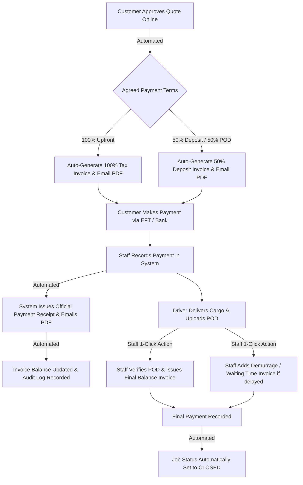

# Automated Logistics Order & Billing System — Technical Architecture & Implementation Reference

**Client / Brand:** Menard Trading CC (`menardtrading.com`)  
**Project Overview:** End-to-end automated freight order processing, PO extraction, quotation generation, driver POD workflow, multi-stage billing, and payment receipting.

---

## 1. Email Ingestion & Purchase Order (PO) Extraction

### Ingestion Pipeline: Dual Webhook & IMAP Architecture
* **Primary Ingestion (Real-Time Webhook Push):**
  * Implemented in `apps/webhooks/views.py` (`BrevoInboundWebhookView`) listening at `/api/webhooks/brevo/`.
  * Ingests inbound emails and attachments in `< 50ms`.
  * Generates deterministic SHA-256 message fingerprints for strict idempotency to prevent duplicate PO creation on webhook retries.
  * Creates an `InboundEmailMessage` and queues an optimistic auto-acknowledgment email immediately.
* **Secondary Ingestion (SSL IMAP Mailbox Polling Fallback):**
  * Implemented in `apps/orders/imap_service.py` (`sync_orders_mailbox`).
  * Connects directly to `orders@menardtrading.com` over SSL (Port 993).
  * Can be executed manually, scheduled via Linux `cron`, or run 24/7 as a background daemon using `python manage.py sync_inbox --daemon`.

### PDF Parsing & Data Extraction Engine
* **Extraction Hierarchy (`apps/orders/services.py`):**
  * **Primary Extractor:** `pdfplumber` (`pdfplumber.open`) extracts digital text layers and layout coordinates from incoming PO PDF documents.
  * **Fallback Extractor:** `pypdf` (`pypdf.PdfReader`) takes over gracefully if `pdfplumber` fails or encounters corrupt stream objects.
* **Heuristic Regex Normalization (`parse_po_text` in `apps/orders/services.py`):**
  * **PO Reference Number:** Multi-pattern regex matching (`Purchase Order #`, `PO No.`, `Order Ref`).
  * **Weight & Cargo Volume:** Converts weight strings (`kg`, `kilograms`, `tons`, `tonnes`) to standardized decimal metric tons.
  * **Pallet & Unit Count:** Identifies pallet counts (`EA`, `plt`, `pallets`).
  * **Corridor & Route Detection:** Automatically extracts origin and destination locations (e.g., Johannesburg, Durban, Walvis Bay, Windhoek, Gaborone, Lusaka, Lubumbashi, Katima Mulilo).
  * **Customer & Buyer Details:** Identifies company legal suffixes (`CC`, `(Pty) Ltd`, `Enterprises`), buyer contact names, phone numbers, and email addresses.

### Role of OpenCV (`opencv-python`)
* **Not used for OCR:** Text extraction on standard digital POs is performed by `pdfplumber` / `pypdf`.
* **Image Cleaning & Watermark Removal:** OpenCV is utilized in `menard_core/image_cleaner.py` (`detect_and_remove_watermarks`, `clean_uploaded_image`) for computer vision preprocessing:
  * Detects and removes stock stamps, copyright overlays, and border artifacts from user-uploaded company logos and login background wallpapers.
  * Uses Sobel edge detection gradients, morphological filtering, and Navier-Stokes / Telea inpainting (`cv2.inpaint`).

---

## 2. PDF Generation Engine & pyHanko

### Document Generation (`apps/billing/pdf_services.py`)
* Generates pixel-perfect, branded, SARS-compliant documents:
  * **Quotations:** `quotation_pdf.html`
  * **Tax Invoices:** `invoice_pdf.html` (Full, Deposit, Balance, and Add-on variants)
  * **Official Payment Receipts:** `receipt_pdf.html`
* Rendered from Django HTML/Tailwind templates into PDF binaries using `xhtml2pdf` (`pisa`) and `WeasyPrint` compatible template styling.
* Dynamically embeds company VAT numbers, registration numbers, banking details, and branded CSS styling.

### Role of pyHanko
* `pyHanko` and `pyhanko-certvalidator` are included in `requirements.txt` to support enterprise cryptographic PAdES digital signatures and PDF certificate verification.
* Standard document rendering currently produces SARS-compliant branded HTML-to-PDFs; cryptographic certificate signing is provisioned as an enterprise compliance layer.

---

## 3. Background Tasks & Concurrency

### Database-Backed Queue (No Celery/Redis Broker Overhead)
* Built without Celery / Redis / RabbitMQ infrastructure complexity.
* Employs transactional, database-backed queue models:
  * `InboundEmailMessage`: Tracks raw inbound email payloads, processing states, and errors.
  * `EmailQueueMessage`: Manages outbound transactional emails across Brevo SMTP departments (`orders@`, `quotes@`, `invoicing@`, `logistics@`).

### Worker Daemon & Execution Modes
* **Management Command:** `python manage.py run_email_worker`
  * `--daemon`: Runs continuously as a systemd background daemon with configurable poll intervals (default: 5s).
  * `--once`: Runs a single batch cycle and exits, suitable for Linux `cron` execution.
* **Concurrency & Safety Mechanics (`apps/orders/email_worker.py`):**
  * Uses database row-level locking (`select_for_update(skip_locked=True)`) to guarantee concurrency safety across multiple workers.
  * Implements exponential backoff retry schedules for SMTP failures (`1m, 5m, 15m, 30m`).
  * Creates unread `AdminNotification` alerts for operators if maximum delivery retries are exhausted.

---

## 4. Operational Scale & Productivity Impact

### Scale
* Designed for regional cross-border road freight operations managing approximately **50 to 200 high-value logistics orders, consignments, and transport contracts per month**.

### Manual Time Replaced
| Workflow Stage | Manual Process (Before) | Automated System (After) |
| :--- | :--- | :--- |
| **PO Intake** | 10–15 mins manually reading emails and opening attachments | **< 50ms** automated ingestion & deduplication |
| **Data Entry** | 10–15 mins transcribing weights, routes, and cargo to ERP/Excel | **Instant** regex & table extraction into DB models |
| **Quotation** | 10 mins drafting quotes in Word/Excel and manually emailing | **Instant** draft quote generation with 1-click customer approval link |
| **Invoicing** | 10 mins calculating deposit splits, milestone balances, and PDF export | **1-Click** automated invoice generation (Full, Deposit, Balance, Add-on) |
| **Receipting** | 5–10 mins writing receipts and reconciling customer balances | **Automated** instant PDF receipt generation and Brevo email dispatch |
| **Total Touch Time** | **30–45 minutes per order** | **< 1 minute total operational supervision** |

---

## 5. Invoicing & Payment Lifecycle

### Automated vs. Staff-Initiated Workflow

1. **Automated on Quote Acceptance (`apps/quotes/views.py`):**
   * When a client approves a quotation via the secure 1-click approval portal, the system **automatically** creates the `LogisticsJob` and generates the initial invoice (`100% FULL` or `PARTIAL_DEPOSIT`, e.g., 50% mobilization deposit) and dispatches it with the PDF.
2. **Automated Payment Receipting (`RecordPaymentActionView` in `apps/billing/views.py`):**
   * Recording a payment atomically updates invoice `amount_paid` and `balance_due`, creates a `PaymentReceipt`, generates `RCP-xxxx.pdf`, and emails the receipt to the client.
   * If all invoices are fully paid and no uninvoiced balance remains, the job is automatically transitioned to `CLOSED`.
3. **Staff-Initiated Milestone Invoicing (`IssueInvoiceActionView` in `apps/billing/views.py`):**
   * **Final Balance Invoices (upon POD upload)** and **Add-on Invoices (demurrage, driver detention waiting hours, route border clearance fees)** are triggered by operations staff using 1-click modal actions.
   * **Design Rationale:** Requiring a human checkpoint allows operations managers to inspect the physical signed Proof of Delivery (POD) document and verify offloading bay waiting times before billing the customer.
